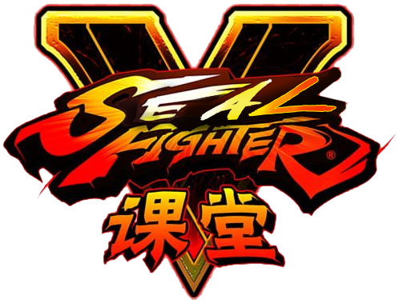

  

# Seal Fighter V

## Full-stack developer technical test 👨‍💻

Welcome to our full-stack developer technical test repository.
If you are here, either you are going through a recruitment phase to work with us, you are just curious, or you have nothing better to do!

Whatever the situation is, we are going to present you with an exercise where you are expected to do some code. But of course, not everything is about code, there is choices, styles, ideas... hopefully it will be fun! 🥳

## General overview 🦭

We love seals, that's something that you need to know for this exercise. We struggle to decide which seal is our favorite. After several discussions, we decided to let themselves choose which one is the best; for this, we started creating a video game: `Seal Fighter V`.

Seals will figth each other and the last seal standing will be the winner.

## The game 🎮

In the current repository you will find the first little bricks of this game. Of course, the technical stack matters: the winner seal has to win in a terrain where we want them to play. So this game will be created in the following environment:

- A [Ruby on Rails](https://rubyonrails.org/) HTTP API, which will handle the back-end and create the bases and rules for the arena they'll be using to fight.
- A [React](https://reactjs.org/) App, that will handle the front-end, and organize the arena itself.
- A quite simple Relational Database ([SQLite](https://www.sqlite.org)) to make things easier for everyone.

## The challenge 🚀

You will take part of the development of the first stages of the game. We just want you to add some few bricks to this amazing project, and get in contact with some seal (and some Ruby, and some JS).

### You should know

- **We do not excpect you to spend an ubelievable amount of hours** working on this project for the technical test. If you love it we can develop the whole game later, but for now, making some choices, doing some modifications and making sure you understand the codebase and are capable of contributing will be more than enough for us to have a technical chat afterwards. **Please DO NOT sacrifice a huge amount of your lovely free time**, just take this as a technical exercise you can work on for a few hours (2 or 3 hours should be enough, and if it is not, please let us know to adapt everything).

- We expect you to be able to do some **work in the front-end AS WELL AS in the back-end**, even if you end up working more in one than the other one, it is important to us to know that any developer in our team is capable of understanding and interacting with the whole environment, even when it is not your field of expertise.

- If something is not doable, can not be completed, or you have an amazing new idea that feels way more interesting than what you are asked to do, please **feel free to take some inicative** and do it. We will just discuss about those choices afterwards. It's a tech test, not a prison!

## First steps

- Set up the back-end environment and get the API running by [reading this guides](api/README.md).

- Set up the front-end environment and get the Home page running by [reading this guides](front/README.md).

## Now let's talk about missions

We have a basic design that shows what we would like our Game to look like in the near future. You can find this design in Figma, [click on this link](https://www.figma.com/file/1F1hraYvSAN7vzhd4e5iMU/Seal-Fighter-V?node-id=0%3A1) and check it out.

